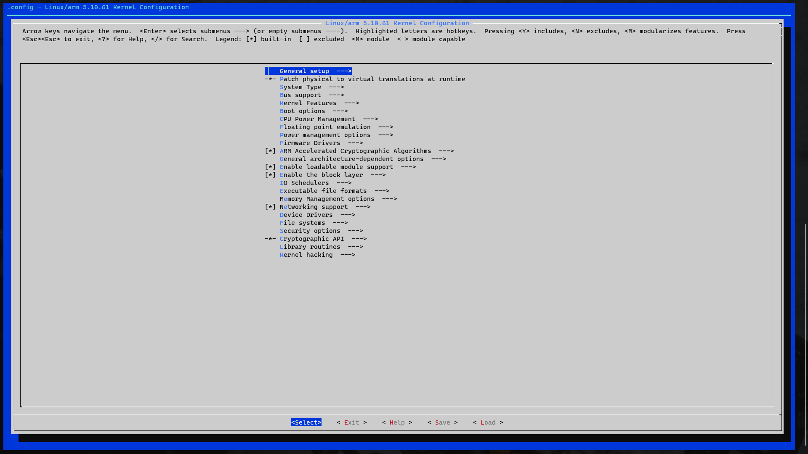
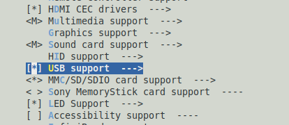
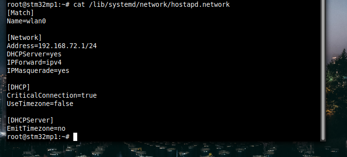
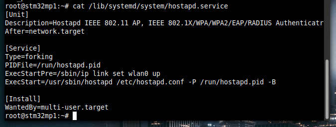

# README Github

# ***ProSE équipe A1 2023 - Corp N’ Roses***

## Copyright

This document belongs to :

Milo Koson, Clément Le Goffic, Thibault Malary, Alfred Vrignaud, Marin Bonsergent, Jean-Théophane Deschard, Loris Bousquet

This README was written by [Clément Le Goffic](https://github.com/Upsylonbare/RobHotChiliPeppers)

## Requirements :

Material :

- Discovery kit [STM32MP157C-DK2](https://www.st.com/en/evaluation-tools/stm32mp157c-dk2.html) from *STMicroelectronics*
- LiDAR : [RPLIDAR A1M8](https://www.slamtec.com/en/Lidar/A1) from *Slamtec*
- USB A to Micro USB B Cable
- USB C to USB A Cable and USB C to USB C to make sure you can connect to the board depending on your situation
- 5V/3A Power supply
- Android Smartphone (Developed on and for a Samsung Galaxy A20e under Android 9 et with kernel v4.4.111)

Software :

- [Android Studio](https://developer.android.com/studio)
- [Visual Studio Code](https://code.visualstudio.com/)
- [STM32CubeProgrammer](https://www.st.com/en/development-tools/stm32cubeprog.html)

## ACDSoft Install (C app) :

### STM32MP157C-DK2 setup :

### Prepare OpenSTLinux Install

1. Install OpenSTLinux on the MP1 (STM32MP157C-DK2) with this [video](https://youtu.be/Ot8B30tc-3E)
    1. Download [STM32MP1 Starter Package Image](https://wiki.st.com/stm32mpu/wiki/STM32MP1_Starter_Package_-_images)
2. The MP1 must start on OpenSTLinux before trying the next steps

### Add CP210x driver to the kernel for the LiDAR

1. [Install the SDK](https://wiki.st.com/stm32mpu/wiki/Getting_started/STM32MP1_boards/STM32MP157x-DK2/Develop_on_Arm%C2%AE_Cortex%C2%AE-A7/Install_the_SDK) 
2. Then [Modify rebuild and reload the kernel](https://wiki.st.com/stm32mpu/wiki/Getting_started/STM32MP1_boards/STM32MP157x-DK2/Develop_on_Arm%C2%AE_Cortex%C2%AE-A7/Modify,_rebuild_and_reload_the_Linux%C2%AE_kernel) :
    1. Folow 1,2 and 3 steps 
    2. **⚠️** Don’t do the 4 step for the moment ! **⚠️**
3. Configure the kernel for the CP210x driver :
4. In the linux source folder :
    1. 
    
    ```bash
    $> make ARCH=arm menuconfig
    ```
    
5. Make sure at the top left corner you see Linux/arm and not (x86) (If it is the case go on else source the sdk and retry)



1. Go to Device Driver > USB Support



1. Go to USB Serial Convert and enable it by setting a star with the space bar


1. Enable “CP210x family of UART Bridge Controllers”


1. Save with the name .config and leave
2. Then you can follow the 4 and 5 steps on the [tutorial](https://wiki.st.com/stm32mpu/wiki/Getting_started/STM32MP1_boards/STM32MP157x-DK2/Develop_on_Arm%C2%AE_Cortex%C2%AE-A7/Modify,_rebuild_and_reload_the_Linux%C2%AE_kernel)
3. Restart the MP1
4. To make sure you made a good job :
    1. Check if the interface /dev/ttyUSB0 exists on the board when the LiDAR is connected

If it is ok you can go to the next step

### MP1 Internal Setup


1. If needed [change the qwerty setup to azerty](https://wiki.st.com/stm32mpu/wiki/How_to_configure_the_Weston_keyboard_layout)
    1. ⚠️ You must use VI : ⚠️
       
        Mini tutorial :
        
        Hit i to enter in insert mode
        
        Change what you want
        
        When you finished hit escape then type :x to leave while saving changes
        

### Configure Wifi :

1. Hit the icon NetDataPerfMonitor on the default MP1 screen
2. Enable the “netdata over wifi” switch
3. In /lib/systemd/network/hostpad.network 
   
    Add :
    
    ```bash
    [Netwwork]
    Address=192.168.72.1/24
    ```
    
    As shown here
    
    
    
4.  Save and exit
5. Check the changes 
   
    ```bash
    cat /lib/systemd/network/hostpad.network
    ```
    
6. Add SSID and Password :
   
    In /etc/hostapd.conf
    
    Add :
    
    ```bash
    ssid=MP1SERVER
    ```
    
    and
    
    ```bash
    wpa_passphrase=stm32mp1
    ```
    
    As shown in the picture :
    
    
    
7. Save and exit
8. In /lib/systemd/system/hostpas.service add :
   
    ```bash
    ExecStartPre=/sbin/ip link set wlan0 up
    ```
    
    As shown here :
    
    
    
9. Save and exit
10. Enable Access Point
    
    ```bash
    $>systemctl enable hostapd
    ```
    
    And reboot
    
    ```bash
    $>reboot
    ```
    
11. Now you can connect to the access point using the SSID and the password you set up. If not [troubleshoot](https://wiki.st.com/stm32mpu/wiki/How_to_configure_a_wlan_interface_on_hotspot_mode)

### Change screen parameters

Make the screen in portrait mode :

1. In /etc/xdg/weston/weston.ini
   
    Remove the lines
    
    ```bash
    transform=270
    #LTDC connector [output] name=DPI-1 mode=preferred
    ```
    
    Add the following line in DSI connector part after “mode=preferred” 
    
    ```bash
    transform=0
    ```
    
2. To change the background, in the same file change the line
   
    ```bash
    background-image=<PATH>
    ```
    
    With the path of your wanted background (screen size 480x800px)
    

## Compile and Launch ACDSoft

1. In the home repository
   
    ```bash
    $> make help
    ```
    

And follow instructions !

1. Launch on the MP1
   
    ```bash
    $> make all TARGET=mp1
    ```
    
2. Connect your PC to the wifi network generated by the MP1
3. Send the binary
   
    ```bash
    $> scp bin/ACDSoft root@192.168.72.1:
    ```
    
4. Connect to the MP1 and launch it
   
    ```bash
    $> ssh root@192.168.72.1
    $> ./ACDSoft
    ```
    

# NirvanApp Install (Android app)

1. Launch Android Studio
2. Open the Android project `File` > `Open` > `NirvanApp` (the folder)
3. Branch the Android phone to your PC in debug mode with file transfer activated
4. Launch the transfer of the app by hiting Run  (or Maj+F10)
5. Launch NirvanApp on the phone